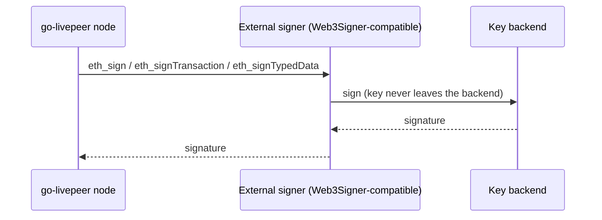

# External signer (remote Ethereum key custody)

By default a go-livepeer node that needs an Ethereum key (a payment [remote signer](./remote-signer.md), an orchestrator, or a gateway running onchain) holds that key as a local keystore file and unlocks it into process memory. The **external signer** lets the node delegate signing to a separate signing service instead, so the private key never lives on the node host.

This is most valuable for a shared, pooled-wallet payment signer: the signer holds a hot key that funds on-chain deposit/reserve and signs probabilistic micropayment (PM) tickets. Moving that key behind an external signer removes the worst failure mode (host compromise drains the deposit/reserve) and, depending on the backend, lets it enforce signing policy.

## How it works

Signing in go-livepeer already goes through a single interface (`eth.AccountManager`: `Sign`, `SignTx`, `SignTypedData`, ...). The external signer is an alternative implementation of that interface that, instead of touching a local keystore, proxies each request over JSON-RPC to a signing service that speaks the standard Ethereum `eth_*` signing namespace (the [Web3Signer](https://docs.web3signer.consensys.io/) protocol).



The node still builds every transaction itself (nonce, gas) and broadcasts via its own Ethereum RPC; the external signer only returns a signature. Nothing about the protocol changes: PM tickets, deposit/reserve funding, redemption, and the gateway -> orchestrator flow stay byte-identical. Only *how* a signature is produced changes.

Signatures are byte-compatible with the local keystore path: messages are signed over the EIP-191 personal-message hash (`accounts.TextHash`), transactions with the latest signer for the chain, and the recovery id is normalized to `{27, 28}`.

## Terminology

Three distinct pieces, often conflated:

- **Adapter** — the in-process `eth.AccountManager` in go-livepeer, selected with `-ethExternalSigner`. It speaks the `eth_*` protocol. (This is the part this repo ships.)
- **External signer service** — a standalone process that presents the `eth_*` API and forwards to a custody provider. "Sidecar" describes *one way to deploy it* (co-located with the node); it can equally run as a standalone networked service. Either [Web3Signer](https://docs.web3signer.consensys.io/) or a provider bridge such as [livepeer/external-signer](https://github.com/livepeer/external-signer).
- **Backend** — the custody provider that actually holds the key (Turnkey, or a KMS/Vault/HSM behind Web3Signer).

## Where it sits in the stack

The external signer is the **key-custody layer beneath the signer**. It is independent of — but composes with — the payment control plane *above* the signer (a payment [clearinghouse](https://forum.livepeer.org/t/livepeer-payment-clearinghouse/3264)). End to end:

```
  App / client
        │  OIDC / API key
  ┌─────▼──────────────── control plane, ABOVE the signer ───────────────┐
  │ Payment clearinghouse                                                │
  │   • auth & identity (OIDC / JWT)                                      │
  │   • usage metering (OpenMeter)                                        │
  │   • fiat billing & clearing                                          ─┼──┐
  │   • per-app wallet lifecycle                                          │  │ management
  └─────┬────────────────────────────────────────────────────────────────┘  │ path
        │  /generate-live-payment                                            │
  ┌─────▼──────────────┐                                                     │
  │ Gateway (offchain) │──── media ────▶ Orchestrators                       │
  └─────┬──────────────┘                                                     │
  ┌─────▼─────────────────────┐                                             │
  │ Remote signer             │  builds PM tickets, needs a signature        │
  │ (-remoteSigner)           │                                             │
  └─────┬─────────────────────┘                                             │
        │  eth.AccountManager (Eth.Sign)                                     │
  ┌─────▼──────────── THIS DOCUMENT, the custody layer BELOW the signer ──┐ │
  │ External signer adapter (-ethExternalSigner)        [in go-livepeer]  │ │
  └─────┬──────────────────────────────────────────────────────────────────┘ │
        │  eth_* JSON-RPC                                                    │
  ┌─────▼─────────────────────┐                                             │
  │ External signer service   │  presents eth_*, forwards to the backend     │
  │ (sidecar or standalone)   │  [Web3Signer, or livepeer/external-signer]    │
  └─────┬─────────────────────┘                                             │
        │  provider API                                                      │ provider API
  ┌─────▼─────────────────────────────────────────────────────────────▼────┐
  │ Backend custody                                                         │
  │   Turnkey enclave   ·   or   Web3Signer → KMS / Vault / HSM             │
  │   signing key (never exported)   +   per-app wallets (clearinghouse)    │
  └─────────────────────────────────────────────────────────────────────────┘
```

Two independent paths touch the backend:

- **Signing hot path** (per ticket): `remote signer → adapter → external signer service → backend`. This is what this document covers. The clearinghouse is *not* in this path.
- **Control plane** (the clearinghouse): wraps the remote signer with auth, usage metering, and fiat billing *above* it, and — if it uses an enclave provider — manages per-app wallets directly against the backend's own API (e.g. Turnkey sub-orgs) on a separate **management path**. Key custody and the signing protocol are unchanged whether or not a clearinghouse sits on top.

So the layers compose cleanly: the **clearinghouse** owns identity, metering, and billing; **go-livepeer** owns the signing protocol; the **external signer service + backend** own key custody. Each can change without the others.

## Usage

Point the node at a Web3Signer-compatible endpoint and tell it which address that endpoint signs for:

- `-ethExternalSigner <endpoint>`: JSON-RPC endpoint of the external signer. When set, signing is delegated to it instead of a local keystore.
- `-ethAcctAddr <0x...>`: the Ethereum address the external signer holds. Required in this mode, since there is no local keystore to default from.
- `-ethExternalSignerTimeout <duration>`: per-call timeout for signing requests (default `5s`). Bounds the PM ticket hot path so a slow or hung signer fails fast instead of blocking minting.

When `-ethExternalSigner` is set, the usual keystore flags (`-ethKeystorePath`, `-ethPassword`) are not used for signing. The node fails fast at startup if the endpoint is unreachable or does not respond to the `eth_*` signing API.

Example (a payment remote signer backed by an external signer):

```bash
./livepeer \
  -remoteSigner \
  -network mainnet \
  -httpAddr 127.0.0.1:7936 \
  -ethUrl <eth-rpc-url> \
  -ethAcctAddr 0xYourSignerAddress \
  -ethExternalSigner http://127.0.0.1:9000 \
  ...
```

## Backends

The node speaks one protocol — Web3Signer's `eth_*` namespace (`eth_sign`, `eth_signTransaction`, `eth_signTypedData`, `eth_accounts`). Anything that exposes it works with no go-livepeer change. There are two ways to get there.

### 1. KMS / Vault / HSM — via Web3Signer (config only)

[Web3Signer](https://docs.web3signer.consensys.io/) is a maintained, off-the-shelf signing service with built-in key backends. Run it, point it at your key store, and point go-livepeer at Web3Signer. No code on either side.

| Backend | How |
|---|---|
| HashiCorp Vault | Web3Signer Vault key source |
| AWS KMS / AWS Secrets Manager | Web3Signer AWS key source |
| Azure Key Vault | Web3Signer Azure key source |
| HSM (PKCS#11 / YubiHSM) | Web3Signer HSM key source |

The choice of backend is a Web3Signer configuration detail; go-livepeer is unaware of it and never changes when you switch.

### 2. Turnkey / MPC / enclave custody — via an external signer service

Providers like [Turnkey](https://www.turnkey.com/) and Fireblocks use proprietary, policy-aware APIs that speak neither standard protocol. Run a thin external signer service (deploy it as a sidecar or standalone) that presents the `eth_*` API and forwards to the provider, holding the provider credentials. The provider-specific code and secrets live in that service, outside go-livepeer. See [livepeer/external-signer](https://github.com/livepeer/external-signer).

## Custody security ladder

Backends differ in how much they protect the key. From weakest to strongest:

| Option | Key stealable from host? | Abuse during host compromise | Ethereum spend policy |
|---|---|---|---|
| Local keystore (default) | Yes — permanent loss | Full | No |
| KMS / Vault / HSM (via Web3Signer) | No (never exported) | Possible while host creds valid; revocable + audited | No |
| Turnkey / enclave (via external signer service) | No | Bounded by policy | Yes (limits, allowlists, quorum) |

KMS/Vault/HSM remove key exfiltration but still sign whatever digest they are asked to. Enclave/MPC custody additionally enforces signing policy, so even a fully compromised signer host cannot drain beyond the configured limits.

## Caveats

- **Raw-hash signing.** PM tickets are signed as a hash. `eth_sign` / `eth_signTypedData` reconstruct the digest from the message/structured input, so backends that refuse raw precomputed-hash signing still work. Verify this against your backend before production.
- **Hot-path latency and cost.** PM mints tickets frequently. Each signature is now an API round-trip rather than a local operation, which adds latency and (for hosted backends) cost. Measure against your minting rate, and tune `-ethExternalSignerTimeout` so a stalled signer fails fast rather than blocking minting.
- **Treat the endpoint like an internal wallet service.** Run the external signer on a private network or behind an authenticated proxy, the same as the [remote signer guidance](./remote-signer.md#operational--security-guidance).
