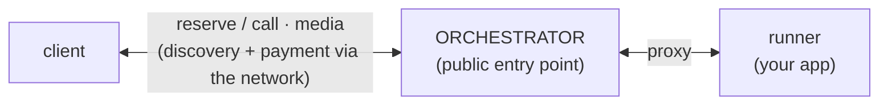
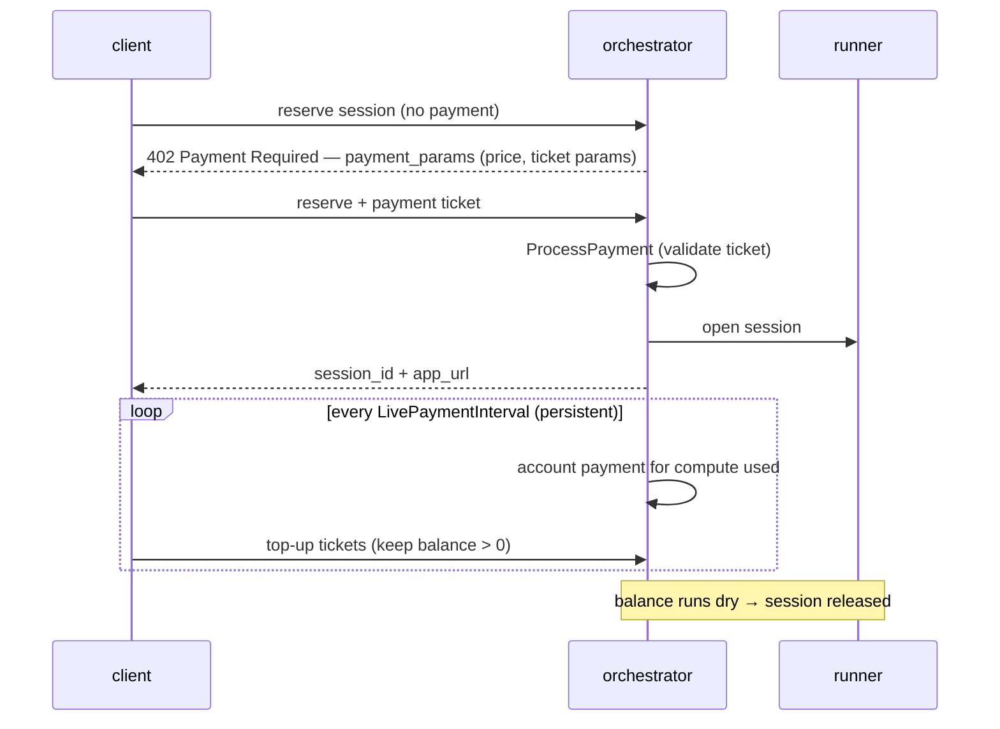

# Live Runner (passthrough runner)

## Why it exists

**The goal is passthrough:** bring your **own container** and run it on Livepeer —
no Livepeer-specific protocol to learn. You write an ordinary HTTP / SSE /
WebSocket service; the orchestrator runs it, proxies clients to it, and bills by
compute time, while the network handles discovery, payment, and routing.

**Optionally**, it also offers a lean, Livepeer-specific realtime communication
schema — **trickle** — that apps can reach for when they need the best realtime
performance (resilient, fan-out realtime video). Plain HTTP / SSE / WebSocket
work out of the box; use trickle only when you want it.

It continues and replaces the community-driven
**[Bring Your Own Container (BYOC)](byoc.md)** effort, generalizing and hardening it.

Enabled on the orchestrator with `-useLiveRunners`.

## Big picture



> [!NOTE]
> The orchestrator is always in the middle — the public entry point, with the
> runner reachable only via it. Direct client ↔ runner communication is being
> investigated and may be supported in the future.

## Registration: how the orchestrator learns about your app

The orchestrator must know your app exists and where to reach it. Two ways — they
differ in **who initiates** and how liveness is tracked (**push** vs **poll**):

```text
  DYNAMIC — app registers & pushes          STATIC — operator configures; orch polls
  ────────────────────────────────          ────────────────────────────────────────
  app ─register_runner()─►  orch            runners.json ─►  orch   (-liveRunnerConfig)
  app ─heartbeat ────────►  orch            orch  ─GET /health─►  app
```

| | Dynamic | Static |
| --- | --- | --- |
| Who registers | the **app** (SDK: `register_runner` + heartbeat) | the **operator** (`runners.json` + `-liveRunnerConfig`) |
| App knows Livepeer? | yes (embeds the SDK) | **no** — any off-the-shelf container |
| Pricing | **runner**-reported via `register_runner` (see note) | **operator**-set in `runners.json` (`price_info`) |
| Liveness | **push** — app heartbeats; orch expires it after ~20s of silence | **poll** — orch GETs `health_url`; down when it stops returning 200 |
| Reattach | SDK **re-registers** when heartbeats resume — no restart | routable again when `health_url` returns 200 |
| Best for | apps that come and go; trickle (needs the orchestrator URL) | fixed deployments; unmodified images |

When a runner drops, its in-flight sessions are dropped — recovery is automatic
either way (no restart). Registry + capacity: `ai/runner/live_runner.go`.

> [!NOTE]
> **Dynamic pricing is reported by the runner — by design.** It keeps provisioning
> (price, hardware, workload) configured *with the runner*, not in go-livepeer, so
> runners connect and go without a mutual dependency. The operator controls the price
> through how it provisions the runner (e.g. env → `register_runner`); go-livepeer
> only checks it is `> 0` (`normalizeHeartbeat`). Want go-livepeer to own pricing? Use
> **static** (`price_info` in `runners.json`). Future GPU-based pricing may add an
> orchestrator override.

## Runner mode: single-shot vs persistent

The runner declares how long each session lives — one call, or held open for a
stream. This `mode` (set at registration) drives both lifecycle and billing.

| | single-shot | persistent |
| --- | --- | --- |
| Lifecycle | reserve → one request → result → **close** | reserve → **held open** for the session |
| Fits | one-off jobs (HTTP request/response, batch inference) | realtime / streaming (trickle, long-lived WebSocket/SSE) |

**Persistent** holds the reserved session open so streams keep flowing. **Single-shot**
reserves only for one call, returns the result, and releases the slot. Use single-shot
for stateless request/response work; persistent for anything that streams or holds state.
Billing for both is **per second of compute** over PM — see [Payments](#payments).

## The reverse proxy

Every client request reaches the runner through one handler — `proxyLiveRunner`
in `server/ai_http.go`, route
`/apps/{runner_id}/session/{session_id}/app/{app_path...}`. It is the shared
**front door for all schemas**, passthrough and trickle alike.

```text
client ──►  ORCHESTRATOR  ──►  runner
            │
            ├─ ReverseProxy — same path for HTTP and WebSocket (Upgrade → 101)
            └─ Rewrite()    — forward {app_path}, inject 4 session headers
```

- `httputil.ReverseProxy` transparently handles plain HTTP **and** WebSocket
  upgrades on the same path.
- `{session_id}` is in the **URL**, so every connection carrying the same
  `session_id` is the **same session** (look-up, not a new reservation). One
  session can hold many connections (HTTP + several WebSockets + trickle).
- `Rewrite()` injects four session headers on every proxied request:
  `Livepeer-Session-Id`, `Livepeer-Session-Token`, `Livepeer-Runner-Route`,
  `Livepeer-Session-Control`. Passthrough apps can ignore them; **trickle** uses
  them to call back (see [Trickle](#trickle--specialized-realtime-video-segments)).

## Communication schemas

Every request arrives through the reverse proxy above; what happens **after** is
the difference. The orchestrator either simply **forwards that connection** to
your app (passthrough), or the app **provisions separate media channels**
(trickle).

### Passthrough — HTTP, SSE, WebSocket

The orchestrator **reverse-proxies the connection straight through** to your app.
The app reads/writes the connection it was handed and **never calls back**. All
three are forwarded by the same proxy:

| Schema        | Shape                                                        | Use for                                           |
| ------------- | ------------------------------------------------------------ | ------------------------------------------------- |
| **HTTP**      | request → response                                           | control or one-shot jobs (config, batch inference) |
| **SSE**       | one long-lived HTTP response, server → client (it *is* HTTP) | streaming results / tokens / progress             |
| **WebSocket** | one bidirectional socket                                     | low-latency bidirectional streams (audio, events) |

WebSocket is just an HTTP request that **upgrades** — the libraries negotiate
`Upgrade → 101`, the orchestrator only relays it. So the app uses **any standard
library**, no SDK. Transports that can't ride an HTTP upgrade — raw TCP/UDP, WebRTC,
gRPC — aren't proxied; the gap trickle fills.

### Trickle — specialized realtime video segments

Trickle is **not** passthrough — it is Livepeer's own mechanism for **realtime
video**. The media does not ride on the incoming connection; it flows over
separate, **named, server-side channels** (segmented over HTTP) that the app
**provisions by calling the orchestrator back** (`create_trickle_channels`).
This is the *only* transport with a callback — and the only place the headers
below matter.

```text
   setup:  request ──► runner ──create channels──► ORCHESTRATOR (holds in + out)
   in:     client ──► [orch relay] ──► runner       (input — client sends video)
   out:    runner ──► [orch relay] ──► client       (output — runner sends results back)
```

Two separate channels: the runner **reads** input from `in` and **writes** results
to `out`; the client does the reverse. Results come back over `out`, not the
original request — that's what makes it a continuous stream rather than one reply.

#### Why trickle, instead of a plain socket?

For realtime video you want more than a single pipe. Trickle buys:

- **Independent in/out streams** — input and output are separate channels, so they
  don't block each other and can reconnect independently.
- **Resilient reconnect** — each segment is its own HTTP request and the channels
  persist on the orchestrator, so a network blip just reconnects at the next
  segment instead of tearing down the session. (A WebSocket has no built-in
  resumption — a dropped socket restarts from scratch.)
- **Fan-out** — one `out` channel can feed **many** subscribers, not just one
  point-to-point client.
- **Standard HTTP** — each segment is its own ordinary HTTP request (no `Upgrade`,
  no long-lived socket), so it traverses CDNs, proxies, and firewalls that
  mishandle WebSockets.
- **Realtime media policies** — e.g. drop-to-latest, to stay live under load.

The trade-off is a little more latency and the channel-creation callback. So for
point-to-point, lowest-latency streams (e.g. live transcription) a **WebSocket**
is simpler and faster; **trickle** earns its complexity for **resilient, fan-out
realtime video**.

A single app can **combine** passthrough + trickle in one session — e.g. HTTP to
start, SSE/WebSocket for events, trickle for the video.

#### The callback + headers

The four headers the proxy injected are what make the callback work: the runner
echoes them back to create its trickle channels.

```text
1. reserve            client ──► orch:  reserve session  → session_id + app_url
2. call               client ──► orch:  POST app_url/…    (no session headers)
3. proxy → runner     orch   ──► runner: + Livepeer-Session-Id
                                         + Livepeer-Session-Token
                                         + Livepeer-Runner-Route
                                         + Livepeer-Session-Control
4. callback (trickle) runner ──► orch:  create_trickle_channels  (authed by token)
                                 orch returns each channel as {url, internal_url}
5. media              client ─► in.url ─► [orch relay] ─► runner reads in.internal_url
                      runner ─► out.internal_url ─► [orch relay] ─► client reads out.url
```

| Header            | What it is                   | Why the runner needs it                                        |
| ----------------- | ---------------------------- | -------------------------------------------------------------- |
| `Session-Id`      | which session                | the channels are tied to a session id                          |
| `Session-Token`   | per-session auth             | echoed back to authorize the create call (`ValidSessionToken`) |
| `Runner-Route`    | which runner (= `runner_id`) | identifies the runner in the channel endpoint                  |
| `Session-Control` | **address to call back to**  | trickle’s create-channels call needs the orchestrator’s URL    |

Channels come back as **two URLs**: `url` (public — handed to the client) and
`internal_url` (orchestrator-network — used by the runner). The runner is inside,
the client is outside, so each uses its own.

#### Callback address: header (`request`) vs registration (`session_id`)

The runner can get the callback address two ways. This is the one subtlety.

```text
create_trickle_channels(session) — `session` is EITHER:

 ┌─ pass the REQUEST  ──► SDK reads Session-Control header ──► uses the HEADER address
 │     "trust where the orchestrator told me to call back"
 │     ✓ needed for STATIC apps (no registration → header is their only source)
 │     ✓ allows per-session redirect (multi-instance orchestrator)
 │     ✗ fails if the header address is unreachable from the app
 │
 └─ pass the SESSION_ID string ──► no header read ──► uses registration.orchestrator_url
       "call back where I registered"  (only DYNAMIC apps have a registration)
       ✓ always reachable (you registered through that address)
       ✗ cannot honor per-session redirect (fixed to one address)
```

`Session-Control` is built from `ServiceURI()` — the orchestrator’s **public /
client-facing** address (the `-serviceAddr` flag, or the on-chain value when the
flag is empty). That address is correct for **remote** runners but is **not
reachable from a runner co-located in a container** (e.g. compose), where the
runner-facing address is `-liveRunnerAddr` instead.

Consequences:
- **Dynamic + containerized** (the common case) → pass `session_id`, call back on
  the registration URL (`= -liveRunnerAddr`). Reachable everywhere.
- **Static + live** → must use the header → needs `Session-Control` to carry a
  reachable address.

> **Recommended orchestrator fix:** build `Session-Control` from `-liveRunnerAddr`
> when set, falling back to `ServiceURI()`. Then the header is runner-reachable in
> all deployments and apps can use the simple `request` form everywhere.

Two orchestrator addresses, by audience:

| Flag              | Audience               | Used in                                         |
| ----------------- | ---------------------- | ----------------------------------------------- |
| `-serviceAddr`    | **clients** (public)   | discovery, `app_url`, `Session-Control` (today) |
| `-liveRunnerAddr` | **runners** (internal) | heartbeat, control-plane callbacks, trickle     |

## Capacity & sessions

Capacity is **per session, not per connection**.

```text
capacity = N  →  up to N concurrent SESSIONS on this runner

one session (session_id = abc):
    ├─ HTTP /control          ┐
    ├─ WebSocket /events      ├─ all ONE session  → ONE capacity slot
    └─ trickle in/out         ┘
```

- The orchestrator routes up to `capacity` sessions; beyond that it returns 503
  and routes to another runner (`ReserveSession`, `len(sessions) >= Capacity`).
- Connections **within** a session (HTTP, multiple WebSockets, trickle channels)
  do **not** each consume capacity.
- Size `capacity` to what one GPU/app can run: high for light work (ASR), low for
  heavy realtime video.

## Payments

Priced runners are paid per session over the network's
**[probabilistic micropayments](payments.md)** (the ticket protocol also used for
transcoding) — the intended unit is **per second of compute**. The gateway produces
the payment tickets via the [remote signer](remote-signer.md); the orchestrator side
below validates and meters them. It engages at reserve time:



1. **Challenge (`402`)** — the client reserves a session; if the runner is priced, the
   orchestrator replies `402 Payment Required` with `payment_params` (price, ticket
   params, recipient).
2. **Pay** — the client retries with a payment header (a PM ticket) + auth metadata;
   `ProcessPayment` validates it and the session opens.
3. **Meter** — a background processor accounts payment every `LivePaymentInterval`; if
   the balance runs dry the session is released, so the client keeps topping up.

Offchain (free) runners skip all of this — `PaymentInfo` is nil, no `402`, no tickets.

> [!NOTE]
> **Implementation status.** Two things are in flight:
> - The meter still accounts **per pixel** (legacy from live-video-to-video); it is
>   meant to be **per second of compute** — migration in
>   [go-livepeer#3952](https://github.com/livepeer/go-livepeer/pull/3952).
> - Wired for **persistent** sessions only; **single-shot** billing follows the same
>   model but is pending
>   [go-livepeer#3955](https://github.com/livepeer/go-livepeer/issues/3955).

## Reference

- Registry, capacity, sessions, heartbeat — `ai/runner/live_runner.go`
- Reverse proxy + header injection — `server/ai_http.go` (`proxyLiveRunner`)
- Flags — `-useLiveRunners`, `-liveRunnerAddr`, `-liveRunnerConfig`, `-serviceAddr`
- SDK — `livepeer-python-gateway` (`register_runner`, `create_trickle_channels`)
- Examples — the `example-apps` repo (`hello-world` HTTP, `echo` trickle, `vllm` static)
