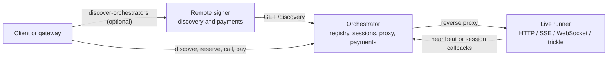

# Live runners

Live runners let an orchestrator expose an external HTTP application through the
Livepeer network. The application can use ordinary HTTP, server-sent events
(SSE), or WebSockets. It can also use Livepeer's
[trickle protocol](../trickle/README.md) when it needs realtime
publish-subscribe channels.

This guide covers the live-runner registry, session, discovery, and proxy APIs.

This document has two parts:

- [Understanding live runners](#understanding-live-runners) explains the
  architecture, registration models, lifecycle, discovery, proxying, capacity,
  and pricing.
- [Reference](#reference) lists the static configuration schema, CLI flags,
  dynamic runner protocol, and HTTP endpoints.

## Understanding live runners

### Architecture

A live runner is an HTTP service managed outside `go-livepeer`. The
orchestrator does not expose the runner's private address to clients. Instead,
it advertises an orchestrator URL and reverse-proxies client requests to the
selected runner. An implication of this is that the runner needs to be
accessible to the orchestrator, ideally on the same machine or local network.



The orchestrator registry tracks each runner's application, metadata, mode,
readiness, capacity, price, and active sessions. Static health checks and dynamic
heartbeats both feed this registry. Discovery only exposes runners that the
registry currently considers ready. The orchestrator only checks runner
liveness but does not attempt to manage it. It will not advertise or route
towards runners that are unhealthy.

The reverse proxy preserves the request method, query string, headers, body,
streaming response, and WebSocket upgrade. It appends the requested application
path to `runner_url` and injects these headers:

| Header | Meaning |
| --- | --- |
| `Livepeer-Runner-Route` | The runner route used by the orchestrator. This is normally a runner ID, or a configured static label. |
| `Livepeer-Session-Id` | The active session ID. |
| `Livepeer-Session-Token` | A session-scoped secret that authorizes runner callbacks. |
| `Livepeer-Session-Control` | The runner-facing base URL for session callbacks. It uses `-liveRunnerAddr` when set and otherwise the orchestrator service URI. |

An ordinary passthrough application can ignore these headers. A runner uses
them when it creates trickle channels, creates another proxied URL, or asks the
orchestrator to stop a session.

### Runner modes and capacity

Registration declares one of two modes:

| Mode | Lifecycle | Typical use |
| --- | --- | --- |
| `persistent` | A client reserves a session, makes one or more requests, and explicitly stops the session. | Realtime video, long-lived SSE or WebSocket connections, and stateful applications. |
| `single-shot` | The orchestrator reserves a session for one proxied request and releases it when that request finishes. | Stateless HTTP request/response and fast batch inference. |

The default is `persistent`. The spelling `single_shot` is accepted during
registration and normalized to `single-shot`.

Capacity counts sessions, not connections. A persistent session may contain
several HTTP requests, WebSockets, proxies, and trickle channels while consuming
one capacity slot. A single-shot request consumes one slot for the duration of
that request. Reserving beyond the advertised capacity returns `503 Service
Unavailable`.

### Static and dynamic registration

The two registration models differ in who owns the Livepeer integration and how
liveness is measured.

| | Static registration | Dynamic registration |
| --- | --- | --- |
| Best suited to | Fixed deployments and unmodified HTTP containers. | Ephemeral or autoscaled, Livepeer-aware applications. |
| Registration owner | The orchestrator operator. | The runner process. |
| Configuration | JSON supplied at startup or to the CLI server. | Runner SDK call and environment/application configuration. |
| Liveness | The orchestrator polls `health_url`. | The runner sends heartbeats. |
| Pricing owner | The operator sets `price_info`. | The runner reports `price_info`. |
| Livepeer code in the application | Not required for basic passthrough. Session callbacks still require implementing the callback API or using an SDK. | Required; an SDK should manage credentials, heartbeat recovery, and callbacks. |

Both models can use persistent or single-shot mode and are exposed through the
same discovery and client endpoints.

### Static registration

Static registration is useful when an operator wants to place an off-the-shelf
HTTP server behind Livepeer without writing additional integration code. Static
runner apps are configured on the orchestrator itself. The configuration
can be done in two ways: through a JSON configuration file via the
`-liveRunnerConfig` flag, or through the CLI API at the `/registerLiveRunners`
endpoint.

To configure live runners, create a JSON file such as `runners.json`:

```json
{
  "runners": [
    {
      "label": "scope-l40s",
      "routing": "label",
      "runner_url": "http://scope-runner:8080",
      "health_url": "/health",
      "healthy_status_code": 200,
      "app": "live-video-to-video/scope",
      "version": "1.4.0",
      "metadata": "{\"deployment\":\"scope-l40s\",\"region\":\"us-west\"}",
      "mode": "persistent",
      "capacity": 2,
      "gpu": {
        "id": "0",
        "name": "NVIDIA L40S",
        "vram_mb": 46068
      },
      "price_info": {
        "price": 3.50,
        "currency": "usd",
        "unit": "hour"
      }
    }
  ]
}
```

In this example, the root-relative health URL resolves to
`http://scope-runner:8080/health`. Label routing makes the public route stable:
the persistent session endpoint ends in `/apps/scope-l40s/session` rather than
an automatically generated runner ID.

Load the file when the orchestrator starts:

```bash
./livepeer \
  -orchestrator \
  -serviceAddr https://orch.example.com:8935 \
  -liveRunnerConfig ./runners.json
```

`-liveRunnerConfig` initializes live-runner support even if
`-useLiveRunners` is not set. Add `-useLiveRunners -orchSecret <secret>` if the
same orchestrator should also accept dynamic registrations.

The configuration can also be upserted while the node is running. The CLI
server defaults to loopback on port 7935 for an orchestrator:

```bash
curl -X POST http://127.0.0.1:7935/registerLiveRunners \
  -H 'Content-Type: application/json' \
  --data-binary @runners.json
```

An upsert preserves a static runner's generated ID and active sessions when its
label already exists. Entries omitted from a later request are not removed.
Validation is atomic: if any entry in the submitted batch is invalid, none of
that batch is registered.

#### Static health and readiness

The orchestrator checks every static `health_url` approximately every five
seconds, using a three-second HTTP client timeout. The runner is healthy only
when the response status exactly matches `healthy_status_code`, which defaults
to 200.

The initial health check happens during registration. An unhealthy static
runner remains registered but is marked unavailable, hidden from discovery,
and cannot accept sessions. If a previously healthy runner becomes unhealthy,
the orchestrator releases its active sessions. It becomes discoverable again
after its health check succeeds. Static runners do not expire under the dynamic
heartbeat TTL and cannot call the heartbeat unregister endpoint.

#### Static pricing

On an on-chain network, every runner must provide a positive `price_info.price`.
The registration price is denominated in USD:

- `currency` defaults to `usd`; no other registration currency is accepted.
- `unit` defaults to `hour` and accepts `hour` or `720p`.
- `hour` is converted to a wei-per-second discovery/payment price.
- `720p` is converted using 720p at 30 fps and is advertised in
  `720p-pixel-seconds`.

The conversion follows the node's USD/ETH price feed. On an offchain network,
runner prices are not advertised and no payment challenge is required.

### Dynamic registration

Dynamic registration is useful when runner processes are ephemeral, autoscaled,
or Livepeer-aware. A dynamic runner registers itself with the orchestrator,
keeps its readiness fresh through heartbeats, and can use session callbacks for
trickle channels, generated proxy URLs, and self-release.

Use a runner SDK instead of implementing the heartbeat protocol directly. The
[Python SDK](https://github.com/livepeer/livepeer-python-gateway) and
[Golang SDK](https://github.com/livepeer/golang-runner) provide helpers
including `register_runner` and `create_trickle_channels`.

Enable dynamic registration on the orchestrator:

```bash
./livepeer \
  -orchestrator \
  -useLiveRunners \
  -orchSecret "$ORCH_SECRET" \
  -serviceAddr https://orch.example.com:8935 \
  -liveRunnerAddr http://go-livepeer:8935
```

`-serviceAddr` is the public, client-facing address. `-liveRunnerAddr` is the
address runners can reach, which is often an internal container or cluster
address. If `-liveRunnerAddr` is omitted, the service URI is used for both
audiences.

The SDK registers with `-orchSecret`, stores the returned heartbeat credential,
keeps the runner's URL, capacity, price, and readiness current, and reconciles
sessions after restarts. If the runner stops heartbeating, it disappears from
discovery and the orchestrator releases its sessions. See
[Dynamic runner protocol](#dynamic-runner-protocol) for the wire-level
heartbeat and unregister behavior.

### Discovery

Discovery has two layers. The orchestrator describes the applications it can
currently serve. A remote signer can aggregate those descriptions across many
orchestrators and provide a single, price-filtered endpoint to clients.

#### Orchestrator discovery

`GET /discovery` reads the orchestrator's current live-runner registry. Static
health results and dynamic heartbeats therefore converge on the same output.
Only ready, non-expired runners are returned.

The response is an array containing an orchestrator address and its runners:

```json
[
  {
    "address": "https://orch.example.com:8935",
    "runners": [
      {
        "url": "https://orch.example.com:8935/apps/scope-l40s/session",
        "gpu": {"id": "0", "name": "NVIDIA L40S", "vram_mb": 46068},
        "app": "live-video-to-video/scope",
        "version": "1.4.0",
        "metadata": "{\"deployment\":\"scope-l40s\",\"region\":\"us-west\"}",
        "mode": "persistent",
        "capacity": 2,
        "capacity_used": 1,
        "capacity_available": 1,
        "price_info": {
          "price": 12345,
          "currency": "wei",
          "unit": "seconds"
        }
      }
    ]
  }
]
```

The `url` is always an orchestrator proxy URL; discovery never leaks the
private `runner_url`. Persistent runners advertise a session-reservation URL
ending in `/session`. Single-shot runners advertise a direct proxy URL ending
in `/app`. Static runners using `routing: "label"` use their label in this URL;
other static runners and all dynamic runners use a runner ID.

`metadata` is optional application-controlled text copied verbatim from the
latest registration. It is public to clients through orchestrator discovery
and remote signer discovery, so it must not contain credentials or other
secrets. Livepeer does not parse or interpret it; applications may serialize
their own format, including JSON, inside the string. The value must be valid
UTF-8 and at most 1,024 UTF-8-encoded bytes. An empty value clears previously
registered metadata and is omitted from discovery.

On-chain discovery includes the converted wei price. Offchain runner discovery
omits it. If the orchestrator also has a serverless AI worker, the response may
contain synthetic live-video-to-video runner records alongside registered live
runners.

#### Remote signer discovery

A remote signer with remote discovery enabled can include live-runner records
from each orchestrator's `GET /discovery` response in
`GET /discover-orchestrators`. This is useful for clients and gateways that use
the remote signer as their discovery source.

The remote discovery snapshot refreshes according to
`-liveAICapReportInterval`, which defaults to 25 minutes. Eligible runner
records must include a URL, an `app`, and on-chain `price_info`; each valid
runner's `app` is added to the address's capability list. See
[Remote signer](remote-signer.md) for source precedence, caching, merging,
filtering, gateway fallback behavior, signer deployment, authentication, and
Ethereum key-management details.

### Session-scoped proxy URLs

The normal application proxy is rooted at `/apps/.../app`. A runner sometimes
needs to expose another HTTP service for the duration of a session or hide the
session ID which could be used to manipulate the session with the orchestrator.
The runner can create an opaque public URL with:


```text
POST /runner/{runner_id}/session/{session_id}/proxy
Livepeer-Session-Token: <session token>

{"target_url":"http://runner.example.internal:9000/ui"}
```

To proxy the original app path itself at `/apps/.../app`, omit the target_url.

The response contains a random `proxy_id` and its public `url`. The target must
be an absolute HTTP or HTTPS URL, must not contain a fragment, and its hostname
must match the hostname of the registered `runner_url`. A different port and
path are allowed. Proxy records are scoped to the session and disappear when
the session is released.

The `-liveRunnerProxyUrl` flag on the orchestrator controls the public URL
shape. It must be an absolute HTTP(S) template with exactly one `{proxy}`
placeholder, either in the host or in the final path segment.

If the flag is empty, the default is derived from the public service URI:

```text
https://orch.example.com:8935/run/{proxy}
```

A path template works with ordinary DNS and TLS:

```text
-liveRunnerProxyUrl https://apps.example.com/run/{proxy}

returned URL: https://apps.example.com/run/abc123
client call:  https://apps.example.com/run/abc123/v1/status?verbose=true
target call:  http://runner.example.internal:9000/ui/v1/status?verbose=true
```

A host template gives each proxy a subdomain:

```text
-liveRunnerProxyUrl https://{proxy}.apps.example.com

returned URL: https://abc123.apps.example.com
client call:  https://abc123.apps.example.com/v1/status
target call:  http://runner.example.internal:9000/ui/v1/status
```

Host templates require wildcard DNS, a matching wildcard certificate, and an
ingress or load balancer that routes all generated hostnames to the same
`go-livepeer` HTTP server. A host template may include a fixed path, for example
`https://{proxy}.apps.example.com/proxy`.

Generated proxy requests go through the same reverse-proxy code as normal app
requests, including query preservation and the four injected Livepeer session
headers.

The proxy ID must be the final template path segment, so a template such as
`https://apps.example.com/run/{proxy}/fixed` is invalid.

### Payments

On-chain runner sessions use Livepeer probabilistic micropayments. Reserving a
priced persistent runner without payment material returns `402 Payment
Required` with payment parameters. The client retries with
`Livepeer-Payment` and `Livepeer-Segment`, then periodically refreshes payment at
`POST /apps/{runner_id}/session/{session_id}/payment`. The orchestrator accounts
usage on its configured payment interval and releases the session if payment
fails.

The current single-shot proxy path does not perform a payment challenge or
accounting. Use persistent mode when on-chain payment enforcement is required.

Offchain runners do not issue payment challenges. For the underlying ticket
protocol, see [Payments](payments.md).

## Reference

### Static runner configuration

The top-level document is an object with a `runners` array. Unknown JSON fields
are currently ignored. Labels in one submitted batch must be unique.

| Field | Type | Required/default | Validation and behavior |
| --- | --- | --- | --- |
| `label` | string | Required | Must be non-empty and already trimmed. Used to identify static entries across upserts. It cannot contain `/` when `routing` is `label`. |
| `routing` | string | Default: `runner-id` | `runner-id` exposes the generated ID in client URLs. `label` exposes `label` instead. |
| `runner_url` | absolute HTTP(S) URL | Required | Private target used by the orchestrator reverse proxy. |
| `health_url` | absolute HTTP(S) URL or root-relative path | Required | A value beginning with `/` is resolved against `runner_url`; otherwise provide a complete URL. |
| `healthy_status_code` | integer | Default: `200` | Must be a valid HTTP status code from 100 through 599. Health requires an exact match. |
| `app` | string | Required | Capability/application identifier, conventionally `pipeline/model`. Must already be trimmed. |
| `version` | string | Default: empty | Advertised through discovery; no semantic-version validation is performed. |
| `metadata` | string | Default: empty | Opaque application-controlled text advertised verbatim through discovery. Must be valid UTF-8 and no more than 1,024 UTF-8-encoded bytes. Empty values are omitted. Do not include secrets. |
| `mode` | string | Default: `persistent` | `persistent`, `single-shot`, or the normalized alias `single_shot`. |
| `capacity` | integer | Default: `1` when zero | Maximum concurrent sessions. Negative values are invalid. |
| `gpu` | object or integer | Optional | Object fields are `id`, `name`, and `vram_mb`. An integer is treated as a local device index; a negative index records only that numeric ID and skips hardware lookup. |
| `price_info` | object | Required onchain; ignored for offchain payment/discovery | `price` is a positive decimal. `currency` defaults to and must equal `usd`. `unit` defaults to `hour` and accepts `hour` or `720p`. |

### CLI flags

Defaults below are the defaults in `go-livepeer`; deployment wrappers may set
different values. This section only lists flags that directly configure live
runners, plus the existing orchestrator settings that live runners depend on.
General node mode, network, discovery, pricing, HTTP listener, CLI listener, and
remote signer flags remain documented with their owning features.

#### Live-runner orchestrator

| Flag | Default | Purpose and interactions |
| --- | --- | --- |
| `-useLiveRunners` | `false` | Initializes live-runner support without requiring a static file. Dynamic use requires `-orchSecret`. |
| `-liveRunnerConfig` | empty | Path to a static JSON configuration loaded at startup. Setting it also initializes live-runner support. |
| `-liveRunnerAddr` | empty; falls back to service URI | Absolute HTTP(S) base URL runners use for heartbeat responses, session control, and internal trickle URLs. Useful for container/cluster networking. |
| `-liveRunnerProxyUrl` | `{service URI}/run/{proxy}` | Absolute HTTP(S) public proxy template containing exactly one `{proxy}` in the host or final path segment. |
| `-orchSecret` | empty | Bootstrap `Authorization` value for dynamic registration. Static-only registration can run without it. The value can also be a path according to the general orchestrator-secret behavior. |
| `-serviceAddr` | empty | Public orchestrator URI used in discovery and ordinary `/apps` URLs. It must be configured or otherwise available through the node's advertised service URI. |

Remote signer aggregation, webhook discovery, price filtering, and Ethereum
configuration use the normal discovery, pricing, and remote signer flags. See
[Remote signer](remote-signer.md) rather than duplicating those flags here.

### Dynamic runner protocol

Dynamic runners should normally use an SDK, but the wire protocol is:

1. Bootstrap with `POST /runners/heartbeat` and `Authorization: <orchSecret>`.
2. Continue heartbeating with the derived `heartbeat_secret`.
3. Re-register with the bootstrap secret if a heartbeat returns 404.
4. Shut down cleanly with `POST /runners/{runner_id}/unregister`.

The runner may propose a `runner_id` during bootstrap; if it omits one, the
orchestrator returns a generated ID. A successful initial heartbeat response
includes:

- `runner_id` and the runner-facing `orchestrator` URL;
- `heartbeat_interval` and `heartbeat_ttl`;
- a derived `heartbeat_secret` for follow-up heartbeats;
- the initial orchestrator-to-runner (`o2r`) trickle channel; and
- the orchestrator's authoritative `session_ids` list for this runner.

Runners should use the returned durations rather than hard-code the current
defaults. Follow-up heartbeats may update the runner URL, version, metadata,
status, mode, GPU, application, capacity, price, and runner-reported session
IDs. Metadata is an opaque UTF-8 string with the same 1,024-byte limit and
public-discovery behavior as static metadata; an empty value clears it. Only an
empty status or `ready` is eligible for discovery and reservation; status
values must be lowercase and trimmed.

Each heartbeat response contains the orchestrator's active sessions for the
runner, ordered by creation time. This allows a restarted or partitioned runner
to reconcile local work with the orchestrator, usually by stopping stale local
sessions. The bootstrap secret and O2R channel are only returned on first
registration.

If no valid heartbeat arrives within the TTL, the runner disappears from
discovery and the registry releases its sessions and channels. Static runners
are not subject to this dynamic heartbeat TTL and cannot call the heartbeat
unregister endpoint.

The O2R channel carries JSON messages from the orchestrator to the runner. It
receives a `{"keep":"alive"}` message approximately every ten seconds, plus
`reserved` and `released` session lifecycle events. The opaque channel name
should be treated as a credential.

### HTTP API

The **orchestrator HTTP server** normally uses port 8935. The **orchestrator CLI
server** defaults to `127.0.0.1:7935`. A **remote signer HTTP server** defaults
to `127.0.0.1:8935`. Explicit listener configuration overrides these defaults.

#### Orchestrator CLI endpoint

This endpoint runs on the orchestrator CLI server and is intended for operators.

| Method and path | Authentication | Description | Principal responses |
| --- | --- | --- | --- |
| `POST /registerLiveRunners` | No application-level auth; protect the CLI listener | Atomically validates and upserts a static configuration document. Returns runner IDs and initial health results. | `200`, `400`, `404` when live runners are disabled, `405` |

#### Remote signer endpoint

This endpoint runs on the remote signer HTTP server and is used by clients or
offchain gateways that delegate orchestrator discovery to the signer.

| Method and path | Authentication | Description | Principal responses |
| --- | --- | --- | --- |
| `GET /discover-orchestrators` | No endpoint-level auth; protect the listener externally if required | Returns cached, price-filtered orchestrators with capabilities and runners. Repeated `caps` query parameters apply OR filtering. | `200`, `503` while unavailable/empty |

#### Orchestrator HTTP endpoints

The endpoints below run on the orchestrator HTTP server.

##### Discovery

| Method and path | Caller / authentication | Description | Principal responses |
| --- | --- | --- | --- |
| `GET /discovery` | Clients, gateways, remote signers; no auth | Returns the orchestrator address and currently ready registered/synthetic runners. | `200`, `404` when unsupported |

##### Runner standalone endpoints

These endpoints are called by dynamic runner processes outside a client
session.

| Method and path | Caller / authentication | Description | Principal responses |
| --- | --- | --- | --- |
| `POST /runners/heartbeat` | Dynamic runner; initial `Authorization: <orchSecret>`, then heartbeat secret | Creates or updates a dynamic runner. Initial response includes the derived credential, timing, O2R channel, and active sessions. | `200`, `400`, `401`, `404` |
| `POST /runners/{runner_id}/unregister` | Dynamic runner; `Authorization: <heartbeat_secret>` | Removes a dynamic runner and releases its sessions/channels. Static runners cannot use it. | `204`, `400`, `401`, `404` |

##### Client session and application endpoints

| Method and path | Caller / authentication | Description | Principal responses |
| --- | --- | --- | --- |
| `POST /apps/{runner_id}/session` | Client; no auth offchain. Onchain uses `Livepeer-Payer-Address` for the initial challenge and `Livepeer-Payment` plus `Livepeer-Segment` to reserve. | Reserves a persistent session. Returns `session_id`, `app_url`, and `control_url`; a priced runner first returns a payment challenge. | `200`, `402`, `404`, `503` |
| `POST /apps/{runner_id}/session/{session_id}/stop` | Client; session is identified by the URL | Releases a persistent session, its channels, and proxies. | `204`, `404` |
| `POST /apps/{runner_id}/session/{session_id}/payment` | Paying client; `Livepeer-Payment` and `Livepeer-Segment` | Adds payment for an active session. The payment manifest must match `session_id`. | `200`, `400`, `403`, `404` |
| `ANY /apps/{runner_id}/session/{session_id}/app/{app_path...}` | Client; access is by the reserved public URL | Proxies any HTTP method, SSE response, or WebSocket upgrade to a persistent runner. | Upstream status, `404`, `502` |
| `ANY /apps/{runner_id}/app/{app_path...}` | Client; no application-level authentication | Reserves a single-shot session, proxies one request, then releases it. The current path does not enforce runner payment. | Upstream status, `400`, `404`, `503`, `502` |

The `runner_id` path value may be a static label when `routing` is `label`.

##### Runner session callbacks

All callbacks below require `Livepeer-Session-Token: <token>` for the matching
runner/session.

| Method and path | Request / response | Description | Principal responses |
| --- | --- | --- | --- |
| `POST /runner/{runner_id}/session/{session_id}/channels` | `{"channels":[{"name":"events","mime_type":"application/json"}]}` → channel descriptors | Creates up to 25 named trickle channels. Existing names are idempotent. MIME type defaults to `application/octet-stream`. | `200`, `400`, `401`, `404` |
| `DELETE /runner/{runner_id}/session/{session_id}/channels` | `{"channels":["events"]}` → deleted names | Deletes up to 25 session trickle channels. | `200`, `400`, `401`, `404` |
| `POST /runner/{runner_id}/session/{session_id}/proxy` | `{"target_url":"http://runner.example:9000/ui"}` → `proxy_id` and `url` | Creates a session-scoped public proxy URL subject to the target restrictions described above. | `200`, `400`, `401`, `404` |
| `POST /runner/{runner_id}/session/{session_id}/stop` | Empty body | Lets the runner release its own session. | `204`, `401`, `404` |

##### Generated proxy endpoint

| Method and path | Authentication | Description |
| --- | --- | --- |
| `ANY {liveRunnerProxyUrl}/{app_path...}` | Possession of the opaque generated proxy URL | Resolves the proxy ID, validates the live session, and forwards to the registered target URL. The exact path or host shape comes from `-liveRunnerProxyUrl`. |

Channel and proxy URLs contain random or derived secrets. Do not log or expose
them as public identifiers. See the [trickle protocol reference](../trickle/README.md)
for sequence and header semantics.
