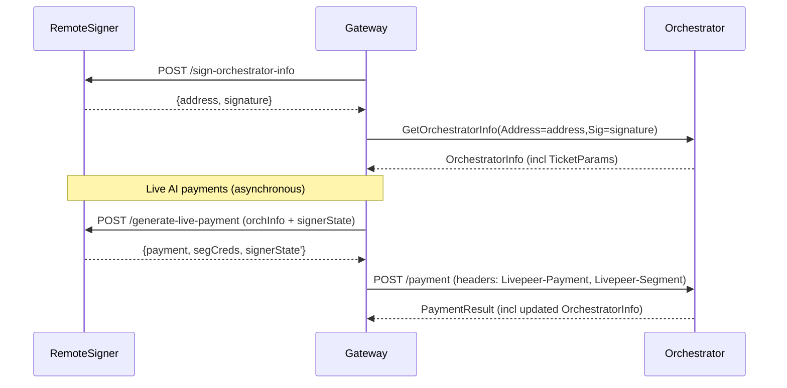

# Remote signer

The **remote signer** is a standalone `go-livepeer` node mode that separates **Ethereum key custody + signing** from the gateway’s **untrusted media handling**. It is intended to:

- Improve security posture by removing Ethereum hot keys from the media processing path
- Enable web3-less gateway implementations natively on additional platforms such as browser, mobile, serverless and embedded backend apps
- Enable third-party payment operators to manage crypto payments separately from those managing media operations.

## Current implementation status

Remote signing was designed to initially target **Live AI** (`live-video-to-video`).

Support for other workloads may be added in the future.

The on-chain service registry is not used for Live AI workloads right now, so orchestrator discovery is not implemented as part of the remote signer. The gateway can learn about orchestrators via an orchestrator webhook (`-orchWebhookUrl`) or a static list (`-orchAddr`).

This allows a gateway to run in offchain mode while still working with on-chain orchestrators.

## Architecture

At a high level, the gateway uses the remote signer to handle Ethereum-related operations such as generating signatures or probabilistic micropayment tickets:



## Usage

### Remote signer node

Start a remote signer by enabling the mode flag:

- `-remoteSigner=true`: run the remote signer service

The remote signer is intended to be its own standalone node type. The `-remoteSigner` flag cannot be combined with other mode flags such as `-gateway`, `-orchestrator`, `-transcoder`, etc.

**The remote signer requires an on-chain network**. It cannot run with `-network=offchain` because it must have on-chain Ethereum connectivity to sign and manage payment tickets.

The remote signer must have typical Ethereum flags configured (examples: `-network`, `-ethUrl`, `-ethController`, keystore/password flags). See the go-livepeer [devtool](https://github.com/livepeer/go-livepeer/blob/92bdb59f169056e3d1beba9b511554ea5d9eda72/cmd/devtool/devtool.go#L200-L212) for an example of what flags might be required.

The remote signer listens to the standard go-livepeer HTTP port (8935) by default. To change the listening port or interface, use the `-httpAddr` flag.

Example (fill in the placeholders for your environment):

```bash
./livepeer \
  -remoteSigner \
  -network mainnet \
  -httpAddr 127.0.0.1:7936 \
  -ethUrl <eth-rpc-url> \
  -ethPassword <password-or-password-file>
  ...
```

### Gateway node

Configure a gateway to use a remote signer with:

- `-remoteSignerUrl <url>`: base URL of the remote signer service (**gateway only**)

If `-remoteSignerUrl` is set, the gateway will query the signer at startup and fail fast if it cannot reach the signer.

**No Ethereum flags are necessary on the gateway** in this mode. Omit the `-network` flag entirely here; this makes the gateway run in offchain mode, but it will still be able to send work to on-chain orchestrators with the `-remoteSignerUrl` flag enabled.

By default, if no URL scheme is provided, https is assumed and prepended to the remote signer URL. To override this (eg, to use a http:// URL) then include the scheme, eg `-remoteSignerUrl http://signer-host:port`

Example:

```bash
./livepeer \
  -gateway \
  -httpAddr :9935 \
  -remoteSignerUrl http://127.0.0.1:7936 \
  -orchAddr localhost:8935 \
  -v 6
```

## Operational + security guidance

For the moment, remote signers are intended to sit behind infrastructure controls rather than being exposed directly to end-users. For example, run the remote signer on a private network or behind an authenticated proxy. Do not expose the remote signer to unauthenticated end-users. Run the remote signer close to gateways on a private network; protect it like you would an internal wallet service.

Remote signers are stateless, so signer nodes can operate in a redundant configuration (eg, round-robin DNS, anycasting) with no special gateway-side configuration.
