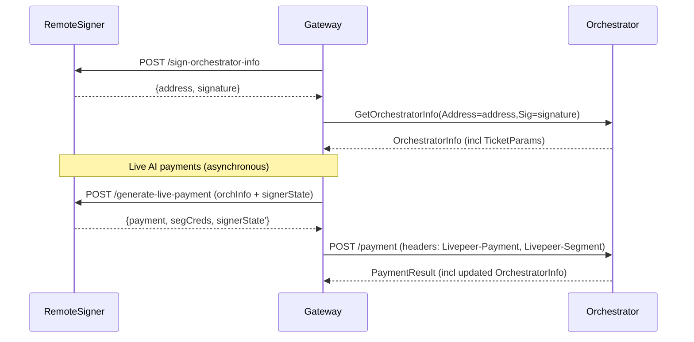

# Remote signer

The **remote signer** is a standalone `go-livepeer` node mode that separates **Ethereum key custody + signing** from the gateway’s **untrusted media handling**. It is intended to:

- Improve security posture by removing Ethereum hot keys from the media processing path
- Enable web3-less gateway implementations natively on additional platforms such as browser, mobile, serverless and embedded backend apps
- Enable third-party payment operators to manage crypto payments separately from those managing media operations.

## Current implementation status

Remote signing was designed to initially target **Live AI** (`live-video-to-video`).

Support for other workloads may be added in the future.

The on-chain service registry is not used for Live AI workloads right now, so orchestrator discovery is not implemented as part of the remote signer. The gateway can learn about its orchestrators via the orchestrator webhook or the orchAddr list flag.

With these two pieces, a `go-livepeer` gateway can operate in **offchain mode** for production Live AI workloads while interacting with **on-chain orchestrators**.

## Architecture

At a high level, the gateway uses the remote signer to handle Ethereum-related operations such as generating signatures or probabilistic micropayments tickets:



## Usage

### Remote signer node

Start a remote signer by enabling the mode flag:

- `-remoteSigner=true`: run the remote signer service

The remote signer is intended to be its own standalone node type. The `-remoteSigner` flag can not be combined with other mode flags such as `-gateway`, `-orchestrator`, `-transcoder`, etc.

**The remote signer requires an on-chain network**. It cannot run with `-network=offchain` - there are no payments and nothing to sign offchain.

The remote signer must have typical Ethereum flags configured (examples: `-network`, `-ethUrl`, `-ethController`, keystore/password flags). See the go-livepeer [devtool](https://github.com/livepeer/go-livepeer/blob/92bdb59f169056e3d1beba9b511554ea5d9eda72/cmd/devtool/devtool.go#L200-L212) for an example of what flags might be required.

The remote signer listens to the standard go-livepeer HTTP port (8935) by default. To change the listening port or interface, use the `-httpAddr` flag.

Example (fill in the placeholders for your environment):

```bash
./livepeer \
  -remoteSigner \
  -network mainnet \
  -httpAddr 127.0.0.1:7936 \
  -ethUrl <eth-rpc-url> \
  -ethController <controller-contract-address> \
  -ethKeystorePath <keystore-path-or-keyfile> \
  -ethPassword <password-or-password-file>
```

### Gateway node

Configure a gateway to use a remote signer with:

- `-remoteSignerUrl <url>`: base URL of the remote signer service (**gateway only**)

If `-remoteSignerUrl` is set, the gateway will query the signer at startup and **fail fast** if it cannot retrieve the signature.

**No Ethereum flags are necessary on the gateway** in this mode. Omit the `-network` flag entirely here; this makes the gateway run in offchain mode, but it will still work on-chain with the `-remoteSignerUrl` flag enabled.

Example:

```bash
./livepeer \
  -gateway \
  -httpAddr :9935 \
  -remoteSignerUrl localhost:7936 \
  -orchAddr localhost:7936 \
  -v 6
```

## Operational + security guidance

For the moment, remote signers are intended to sit behind infrastructure controls rather than being exposed directly to end-users. For example, run the remote signer on a private network or behind an authenticated proxy. Do not expose the remote signer to unauthenticated end-users.

## Live AI payment protocol notes

Remote signing for Live AI is designed to keep the signer service **stateless** while still supporting stateful PM sessions. It does this by round-tripping an opaque “signer state” blob on every request.

- Remote signer nodes can operate in a redundant configuration due to the statelessness
- The gateway retains:
  - the **remote signer state** returned by `/generate-live-payment`
  - the **orchestrator ticket params** (returned via `GetOrchestratorInfo` and updated after `/payment`)
- The remote signer **signs** the serialized state with its Ethereum key and **verifies** the signature on subsequent requests to prevent tampering.
- The gateway should treat the signer state as an **opaque blob** (do not modify it; just store and forward it on the next payment request).
- If the gateway fails to consistently provide the latest state, it can cause:
  - invalid tickets (eg, nonce reuse)
  - excessive ticket generation / overpayment
- High-frequency or concurrent signing calls for the same session are likely to produce invalid tickets and are not an intended use-case.
