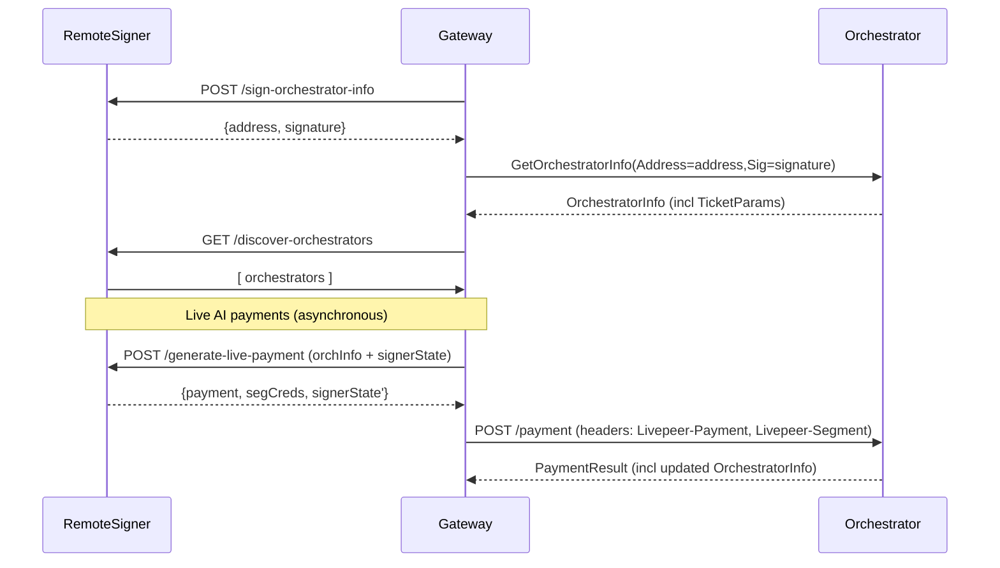

# Remote signer

The **remote signer** is a standalone `go-livepeer` node mode that separates Ethereum key custody + signing from the gateway’s untrusted media handling. It is intended to:

- Improve security posture by removing Ethereum hot keys from the media processing path
- Enable web3-less gateway implementations natively on additional platforms such as browser, mobile, serverless and embedded backend apps
- Enable third-party payment operators to manage crypto payments separately from those managing media operations.

## Current implementation status

Remote signing was designed to initially target Live AI (`live-video-to-video`).

Support for other pipelines may be added in the future.

With remote signers enabled, a gateway runs in offchain mode while still working with on-chain orchestrators.

## Architecture

At a high level, the gateway uses the remote signer to handle Ethereum-related operations such as generating signatures, probabilistic micropayment tickets, or discovering on-chain orchestrators and filtering them by price and capability:


```mermaid
sequenceDiagram
  participant RemoteSigner as RemoteSigner
  participant Gateway as Gateway
  participant Orchestrator as Orchestrator

  Gateway->>RemoteSigner: POST /sign-orchestrator-info
  RemoteSigner-->>Gateway: {address, signature}
  Gateway->>Orchestrator: GetOrchestratorInfo(Address=address,Sig=signature)
  Orchestrator-->>Gateway: OrchestratorInfo (incl TicketParams)

  Gateway->>RemoteSigner: GET /discover-orchestrators
  RemoteSigner->>Gateway: [ orchestrators ]

  Note over Gateway,RemoteSigner: Live AI payments (asynchronous)
  Gateway->>RemoteSigner: POST /generate-live-payment (orchInfo + signerState)
  RemoteSigner-->>Gateway: {payment, segCreds, signerState'}
  Gateway->>Orchestrator: POST /payment (headers: Livepeer-Payment, Livepeer-Segment)
  Orchestrator-->>Gateway: PaymentResult (incl updated OrchestratorInfo)
```

## Usage

### Remote signer node

Start a remote signer by enabling the mode flag:

- `-remoteSigner=true`: run the remote signer service

The remote signer is intended to be its own standalone node type. The `-remoteSigner` flag cannot be combined with other mode flags such as `-gateway`, `-orchestrator`, `-transcoder`, etc.

**The remote signer requires an on-chain network**. It cannot run with `-network=offchain` because it must have on-chain Ethereum connectivity to sign and manage payment tickets.

The remote signer must have typical Ethereum flags configured (examples: `-network`, `-ethUrl`, `-ethController`, keystore/password flags). See the go-livepeer [devtool](https://github.com/livepeer/go-livepeer/blob/92bdb59f169056e3d1beba9b511554ea5d9eda72/cmd/devtool/devtool.go#L200-L212) for an example of what flags might be required.

The remote signer listens to the standard go-livepeer HTTP port (8935) by default. Change the port or interface with the `-httpAddr` flag. The CLI webserver defaults to `127.0.0.1:3935` (loopback only). Override it with `-cliAddr`.

Example (fill in the placeholders for your environment):

```bash
./livepeer \
  -remoteSigner \
  -network mainnet \
  -httpAddr 127.0.0.1:7936 \
  -ethUrl <eth-rpc-url> \
  -ethPassword <password-or-password-file>
  ...
```

### Remote discovery

Remote signers can offer a discovery endpoint for gateways to find what orchestrators are on the network for a given capability. Remote discovery is enabled with:

- `-remoteDiscovery=true`

When enabled, the signer exposes:

- `GET /discover-orchestrators`

The endpoint returns a list of orchestrators (`address`, `score`, `capabilities`, and optional `runners`) in a format that is compatible with the gateway's orchestrator discovery webhook. The `address` field is the orchestrator service address used by gateways, not the signer's Ethereum/account address.

Clients can filter for orchestrators matching a given capability via the `caps` query param. This param can be repeated to retrieve orchestrators supporting any one of the given capabilities. For example:

```bash
# All available orchestrators
curl "http://127.0.0.1:7936/discover-orchestrators"

# Filter by one capability
curl "http://127.0.0.1:7936/discover-orchestrators?caps=live-video-to-video/streamdiffusion"

# Filter by multiple capabilities (OR behavior)
curl "http://127.0.0.1:7936/discover-orchestrators?caps=live-video-to-video/streamdiffusion&caps=text-to-image/black-forest-labs/FLUX.1-dev"
```

The remote signer periodically retrieves the latest orchestrator capabilities and
pricing. Its candidate source is, in precedence order:

1. `-orchWebhookUrl`;
2. `-orchAddr`;
3. on-chain orchestrator discovery when neither explicit source is configured.

The refresh period is configured with `-liveAICapReportInterval`, which defaults
to 25 minutes. Non-empty snapshots are cached for that interval. An empty
snapshot is retried on subsequent requests; until a usable snapshot exists,
`/discover-orchestrators` returns 503.

Orchestrators are pre-filtered for pricing: orchestrators that have a price
higher than what the remote signer is configured for will not be made available
via discovery.

In on-chain remote discovery mode, the signer also reads each orchestrator's
`/discovery` endpoint. Endpoint discovery is fetched with a two-second timeout
and a 1 MiB response limit. A failure to fetch one endpoint does not invalidate
the normal orchestrator record.

Entries are merged by normalized orchestrator address. Within an address,
runners are merged by their public discovery `url`. Identical duplicates are
ignored. If duplicate URLs contain conflicting metadata, the first value is kept
and the conflict is logged. Changing capacity usage alone is not treated as
conflicting metadata.

Remote discovery filters data before exposing it:

- normal orchestrator capabilities must have a price and must satisfy the
  configured capability/model maximum from `-maxPricePerCapability`, falling
  back to the global maximum when applicable;
- runner records require a URL, a non-empty `app`, and a positive wei price;
- runner price units must be `seconds` or `720p-pixel-seconds`; and
- the global `-maxPricePerUnit`, when set, also limits runner prices.

Each valid runner's `app` is added to the address's capability list and can be
matched with the same repeated `caps` query parameters as normal orchestrator
capabilities.

Currently, remote discovery can only be enabled for nodes in remote signing mode.

### Gateway node

Configure a gateway to use a remote signer with:

- `-remoteSignerUrl <url>`: base URL of the remote signer service (**gateway only**)
- `-remoteSignerHeaders 'key:val,key2:val2'`: headers attached to outbound gateway requests to the remote signer (`/sign-orchestrator-info`, `/generate-live-payment`, and `/discover-orchestrators`)

If `-remoteSignerUrl` is set, the gateway will query the signer at startup and fail fast if it cannot reach the signer.

**No Ethereum flags are necessary on the gateway** in this mode. Omit the `-network` flag entirely here; this makes the gateway run in offchain mode, but it will still be able to send work to on-chain orchestrators with the `-remoteSignerUrl` flag enabled.

By default, if no URL scheme is provided, https is assumed and prepended to the remote signer URL. To override this (eg, to use a http:// URL) then include the scheme, eg `-remoteSignerUrl http://signer-host:port`
Headers follow the same comma-separated `key:value` format used by `-liveAIHeartbeatHeaders`.

If the gateway is configured with a remote signer URL but no orchestrators (`-orchWebhookUrl` or `-orchAddr`) then it will attempt to use the remote signer's discovery endpoint. Note that not all remote signers may be offering discovery.

Example:

```bash
./livepeer \
  -gateway \
  -httpAddr :9935 \
  -remoteSignerUrl http://127.0.0.1:7936 \
  -remoteSignerHeaders 'Authorization:Bearer gateway-token,X-Tenant:acme' \
  -orchAddr localhost:8935 \
  -v 6
```

### Pricing checks (gateway vs remote signer)

When running a gateway in offchain mode (ie, with `-remoteSignerUrl` and no Ethereum flags), the gateway does not check orchestrator pricing. Instead, price checks happen in the remote signer during payment generation.

- **Remote signer configuration**: configure the signer with the same pricing and PM knobs you would normally configure on a gateway, e.g.:
  - `-maxPricePerUnit`, `-pixelsPerUnit`
  - `-maxPricePerCapability` (optional, capability/model pricing config)
  - `-maxTicketEV`, `-maxTotalEV`, etc.
- **Selection behavior**: if an orchestrator’s price is above the signer’s configured limits, the signer rejects the payment request (HTTP 481) and the gateway will retry with a different orchestrator session.
- **LV2V session price is fixed**: Live Video-to-Video (LV2V) jobs treat price as fixed for the lifetime of the session, captured at session initialization time.

### Tuning ticket EV to avoid “too many tickets” errors

If there are errors about too many tickets (eg `numTickets ... exceeds maximum of 100`), increase the ticket EV on the remote signer so each signing call produces fewer tickets. A good target is ~1–3 tickets per remote signer call.

For PM configuration details and how these knobs interact, see `doc/payments.md`.

### Payment Authentication

The remote signer's payment endpoint (POST `/generate-live-payment`) supports an optional authentication webhook that can be called during every request. This allows operators to enforce external authorization or policy checks before the signer commits to updated payment state.

Configure the webhook with:

- `-remoteSignerWebhookUrl <url>`: the endpoint that receives the callback
- `-remoteSignerWebhookHeaders 'key:val,key2:val2'`: headers attached to the outbound webhook request for authenticating against the webhook service itself (e.g. `Authorization:Bearer <token>,X-API-Key:<key>`)

Headers follow the same comma-separated `key:value` format used by `-liveAIHeartbeatHeaders`. The headers flag is only meaningful when a webhook URL is configured.

Omit `-remoteSignerWebhookUrl` to disable the webhook entirely.

Example:

```bash
./livepeer \
  -remoteSigner \
  -network mainnet \
  -httpAddr 127.0.0.1:7936 \
  -remoteSignerWebhookUrl https://auth.example.com/livepeer/authorize \
  -remoteSignerWebhookHeaders 'Authorization:Bearer s3cret,X-Tenant:acme' \
  -ethUrl <eth-rpc-url> \
  -ethPassword <password-or-password-file> \
  ...
```

#### Webhook request

The signer sends a `POST` with `Content-Type: application/json` to the configured URL. The JSON body contains:

| Field     | Type                          | Description                                                      |
|-----------|-------------------------------|------------------------------------------------------------------|
| `headers` | `map[string][]string`         | The incoming HTTP request headers from the gateway's payment call |
| `state`   | `RemotePaymentState` (object) | The current payment state, after all updates |

Example body:

```json
{
  "headers": {
    "Content-Type": ["application/json"],
    "Signer-Auth-Id": ["auth-456"],
    "X-Request-Id": ["abc-123"]
  },
  "state": {
    "StateID": "xYz",
    "PMSessionID": "session-1",
    "LastUpdate": "2026-04-07T20:00:00Z",
    "OrchestratorAddress": "0x1234...",
    "AuthExpiry": 0,
    "SenderNonce": 7,
    "Balance": "500/1",
    "InitialPricePerUnit": 1200,
    "InitialPixelsPerUnit": 1,
    "SequenceNumber": 3,
    "AuthID": "auth-456"
  }
}
```

#### Webhook response

The webhook itself must return **HTTP 200** and include a JSON body with:

| Field    | Type    | Required | Description |
|----------|---------|----------|-------------|
| `status` | `int`   | Yes      | The status code the signer should use to decide whether to proceed |
| `reason` | `string`| No       | Error message returned to the gateway caller when `status` is not `200` |
| `expiry` | `int64` | No       | Unix timestamp in seconds until which the authorization can be reused |
| `auth_id` | `string` | No     | Opaque authorization identifier (optional) |

Example success response:

```json
{"status": 200, "expiry": 1775574245, "auth_id": "auth-456"}
```

Example rejection response:

```json
{"status": 403, "reason": "denied"}
```

- **HTTP 200 with `status: 200`**: the signer proceeds to encode and sign the state as normal.
- **HTTP 200 with `status != 200`**: the signer aborts and returns that `status` to the gateway caller, wrapped in the standard API error JSON envelope. If `reason` is present it is used as the error message. This can be used by implementers to steer downstream caller behavior.
- **Any non-200 webhook HTTP response**: the signer treats this as an internal webhook failure (eg, webhook service error or signer misconfiguration) and returns HTTP 500.
- **Missing, zero, malformed, or otherwise invalid `status`**: the signer returns HTTP 500.
- If `auth_id` is omitted, the signer falls back to the incoming request's `Signer-Auth-Id` header. If both are present, the webhook `auth_id` takes precedence.
- Once an auth ID is persisted in signed payment state, a different webhook `auth_id` or fallback `Signer-Auth-Id` on a later request is treated as an internal error and returns HTTP 500.

#### Timing

The webhook fires after the payment state is fully updated (balance, nonce, timestamps) and immediately before the state is marshalled and signed. If the webhook rejects the request, no updated state is returned to the caller and it will be as if the payment were never made.

### Auth webhook expiry caching

When `-remoteSignerWebhookUrl` is configured, the remote signer calls the auth webhook on every `POST /generate-live-payment` request by default. The webhook can opt in to caching its authorization result by returning an `expiry` field alongside `status: 200` in its HTTP 200 JSON response body:

```json
{"status": 200, "expiry": 1775574245}
```

- `expiry` is a Unix timestamp in seconds. While the current time has not exceeded this value, subsequent payment requests reuse the cached authorization and skip the outbound webhook call.
- When the expiry is reached, the signer calls the webhook normally.
- A zero, negative, or absent `expiry` means every request triggers the webhook, if one was configured.

## Operational + security guidance

For the moment, remote signers are intended to sit behind infrastructure controls rather than being exposed directly to end-users. For example, run the remote signer on a private network or behind an authenticated proxy. Do not expose the remote signer to unauthenticated end-users. Run the remote signer close to gateways on a private network; protect it like you would an internal wallet service. If a proxy sits in front of the signer, configure it to scrub all incoming `Signer-` headers from untrusted clients before applying trusted internal headers.

Remote signers are stateless, so signer nodes can operate in a redundant configuration (eg, round-robin DNS, anycasting) with no special gateway-side configuration.

To remove the Ethereum hot key from the signer host entirely (delegating signing to a KMS/HSM via Web3Signer, or to an enclave/MPC provider such as Turnkey), see the [external signer](./external-signer.md) (`-ethExternalSigner`).
