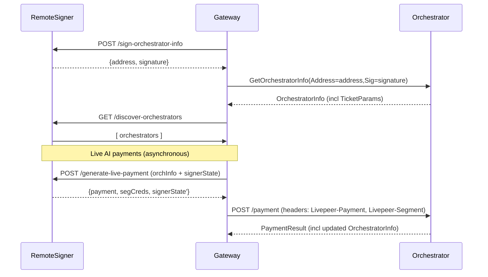

# Remote signer

The **remote signer** is a standalone `go-livepeer` node mode that separates Ethereum key custody + signing from the gateway’s untrusted media handling. It is intended to:

- Improve security posture by removing Ethereum hot keys from the media processing path
- Enable web3-less gateway implementations natively on additional platforms such as browser, mobile, serverless and embedded backend apps
- Enable third-party payment operators to manage crypto payments separately from those managing media operations.

## Current implementation status

Remote signing was designed to initially target Live AI (`live-video-to-video`).

Support for other pipelines may be added in the future.

With remote signers enabled, a gateway runs in offchain mode while still working with on-chain orchestrators.

## Architecture

At a high level, the gateway uses the remote signer to handle Ethereum-related operations such as generating signatures, probabilistic micropayment tickets, or discovering on-chain orchestrators and filtering them by price and capability:


```mermaid
sequenceDiagram
  participant RemoteSigner as RemoteSigner
  participant Gateway as Gateway
  participant Orchestrator as Orchestrator

  Gateway->>RemoteSigner: POST /sign-orchestrator-info
  RemoteSigner-->>Gateway: {address, signature}
  Gateway->>Orchestrator: GetOrchestratorInfo(Address=address,Sig=signature)
  Orchestrator-->>Gateway: OrchestratorInfo (incl TicketParams)

  Gateway->>RemoteSigner: GET /discover-orchestrators
  RemoteSigner->>Gateway: [ orchestrators ]

  Note over Gateway,RemoteSigner: Live AI payments (asynchronous)
  Gateway->>RemoteSigner: POST /generate-live-payment (orchInfo + signerState)
  RemoteSigner-->>Gateway: {payment, segCreds, signerState'}
  Gateway->>Orchestrator: POST /payment (headers: Livepeer-Payment, Livepeer-Segment)
  Orchestrator-->>Gateway: PaymentResult (incl updated OrchestratorInfo)
```

## Usage

### Remote signer node

Start a remote signer by enabling the mode flag:

- `-remoteSigner=true`: run the remote signer service

The remote signer is intended to be its own standalone node type. The `-remoteSigner` flag cannot be combined with other mode flags such as `-gateway`, `-orchestrator`, `-transcoder`, etc.

**The remote signer requires an on-chain network**. It cannot run with `-network=offchain` because it must have on-chain Ethereum connectivity to sign and manage payment tickets.

The remote signer requires the standard Ethereum flags: `-network`, `-ethUrl`, `-ethController`, and either keystore/password flags (local keystore) or `-turnkeyOrg` (Turnkey — see [Turnkey mode](#turnkey-mode-remote-signer) below). See the go-livepeer [devtool](https://github.com/livepeer/go-livepeer/blob/92bdb59f169056e3d1beba9b511554ea5d9eda72/cmd/devtool/devtool.go#L200-L212) for a full example.

The remote signer listens to the standard go-livepeer HTTP port (8935) by default. To change the listening port or interface, use the `-httpAddr` flag.

Example (fill in the placeholders for your environment):

```bash
./livepeer \
  -remoteSigner \
  -network mainnet \
  -httpAddr 127.0.0.1:7936 \
  -ethUrl <eth-rpc-url> \
  -ethPassword <password-or-password-file>
  ...
```

### Remote discovery

Remote signers can offer a discovery endpoint for gateways to find what orchestrators are on the network for a given capability. Remote discovery is enabled with:

- `-remoteDiscovery=true`

When enabled, the signer exposes:

- `GET /discover-orchestrators`

The endpoint returns a list of orchestrators (`address`, `score`, `capabilities`) in a format that is compatible with the gateway's orchestrator discovery webhook.

Clients can filter for orchestrators matching a given capability via the `caps` query param. This param can be repeated to retrieve orchestrators supporting any one of the given capabilities. For example:

```bash
# All available orchestrators
curl "http://127.0.0.1:7936/discover-orchestrators"

# Filter by one capability
curl "http://127.0.0.1:7936/discover-orchestrators?caps=live-video-to-video/streamdiffusion"

# Filter by multiple capabilities (OR behavior)
curl "http://127.0.0.1:7936/discover-orchestrators?caps=live-video-to-video/streamdiffusion&caps=text-to-image/black-forest-labs/FLUX.1-dev"
```

The remote signer periodically retrieves latest orchestrator capabilities and pricing from the network. The periodicity can be configured via the `-liveAICapReportInterval` flag with a default of 25 minutes. Orchestrators are pre-filtered for pricing: orchestrators that have a price higher than what the remote signer is configured for will not be made available via discovery.

Currently, remote discovery can only be enabled for nodes in remote signing mode.

### Gateway node

Configure a gateway to use a remote signer with:

- `-remoteSignerUrl <url>`: base URL of the remote signer service (**gateway only**)

If `-remoteSignerUrl` is set, the gateway will query the signer at startup and fail fast if it cannot reach the signer.

**No Ethereum flags are necessary on the gateway** in this mode. Omit the `-network` flag entirely here; this makes the gateway run in offchain mode, but it will still be able to send work to on-chain orchestrators with the `-remoteSignerUrl` flag enabled.

By default, if no URL scheme is provided, https is assumed and prepended to the remote signer URL. To override this (eg, to use a http:// URL) then include the scheme, eg `-remoteSignerUrl http://signer-host:port`

If the gateway is configured with a remote signer URL but no orchestrators (`-orchWebhookUrl` or `-orchAddr`) then it will attempt to use the remote signer's discovery endpoint. Note that not all remote signers may be offering discovery.

Example:

```bash
./livepeer \
  -gateway \
  -httpAddr :9935 \
  -remoteSignerUrl http://127.0.0.1:7936 \
  -orchAddr localhost:8935 \
  -v 6
```

### Pricing checks (gateway vs remote signer)

When running a gateway in offchain mode (ie, with `-remoteSignerUrl` and no Ethereum flags), the gateway does not check orchestrator pricing. Instead, price checks happen in the remote signer during payment generation.

- **Remote signer configuration**: configure the signer with the same pricing and PM knobs you would normally configure on a gateway, e.g.:
  - `-maxPricePerUnit`, `-pixelsPerUnit`
  - `-maxPricePerCapability` (optional, capability/model pricing config)
  - `-maxTicketEV`, `-maxTotalEV`, etc.
- **Selection behavior**: if an orchestrator’s price is above the signer’s configured limits, the signer rejects the request (HTTP 481) and the gateway will retry with a different orchestrator session.
- **LV2V session price is fixed**: like a traditional gateway setup, Live Video-to-Video (LV2V) jobs treat price as fixed for the lifetime of the session, captured at session initialization time.

### Tuning ticket EV to avoid “too many tickets” errors

If there are errors about too many tickets (eg `numTickets ... exceeds maximum of 100`), increase the ticket EV on the remote signer so each signing call produces fewer tickets. A good target is ~1–3 tickets per remote signer call.

For PM configuration details and how these knobs interact, see `doc/payments.md`.

## Turnkey mode (remote signer)

In Turnkey mode, the remote signer delegates Ethereum key custody to [Turnkey](https://www.turnkey.com/) secure enclaves instead of a local keystore. Private keys are generated and stored entirely within Turnkey; the node holds only an API key.

### Flags

- **`-turnkeyOrg <organizationId>`** — Turnkey organization ID. **Must** be used with `-remoteSigner`. When set, the node uses Turnkey for all signing and skips the local keystore. The standard chain flags (`-ethUrl`, `-network`, `-ethController`) are still required.
- **`-turnkeyApiKeyName <name>`** — Name of the API key loaded from `~/.turnkey/keys/<name>/` (default: `default`). Follows the [tkhq/go-sdk](https://github.com/tkhq/go-sdk) key-store convention.

If the organization has no Ethereum accounts on first start, the node automatically creates a Turnkey wallet and logs its address.

### Signing semantics

The Turnkey integration keeps Ethereum hashing in `go-livepeer` and uses Turnkey only for custody plus ECDSA signing. The signer computes the final 32-byte Ethereum digest locally before calling `SignRawPayload`:

- **`Sign(msg)`** uses the EIP-191 text-hash path (`accounts.TextHash(msg)`).
- **`SignTypedData(...)`** computes the EIP-712 digest locally.
- **`SignTx(...)`** stays on Turnkey's transaction-signing API rather than the raw-payload path.

Because the raw-payload request already receives the final digest, the signer sends that value to Turnkey with **`HASH_FUNCTION_NO_OP`**. This preserves parity with the local keystore implementation and avoids applying an extra hash inside Turnkey.

Do **not** switch this flow to **`HASH_FUNCTION_KECCAK256`** unless the payload contract changes as well. In the current design, that would hash an already-computed Ethereum digest a second time and produce signatures that no longer match the rest of the stack.

### Multi-address signing

A single Turnkey remote signer can manage multiple Ethereum addresses. The node maintains an address book of all Ethereum-format accounts in the organization and uses it to authorize signing requests.

- **`POST /sign-orchestrator-info?address=0x…`** — Selects which address signs the orchestrator info response. Defaults to the node’s current default signing address.
- **`POST /generate-live-payment`** — Accepts an optional JSON field **`signerAddress`** to select which identity signs PM tickets for that session. The returned `state` blob records the chosen address, so all follow-up requests remain pinned to the same identity.

Gateways pin a specific remote signer identity with:

- **`-remoteSignerAddress 0x…`** — Passed as `signerAddress` in every `/generate-live-payment` request and as the `?address` parameter on `/sign-orchestrator-info`, ensuring the gateway consistently uses one Turnkey address.

### Wallet management API

When Turnkey mode is active, the signer exposes the following management endpoints on the same HTTP server. Apply the same network controls used for the rest of the signer.

| Method | Path | Purpose |
|--------|------|---------|
| `GET` | `/turnkey/wallets` | List all wallet IDs, account IDs, and Ethereum addresses in the org |
| `POST` | `/turnkey/create-wallet` | Body: `{"walletName":"..."}` — create a new HD wallet and derive its first Ethereum account |
| `POST` | `/turnkey/create-account` | Body: `{"walletId":"..."}` — derive the next `m/44'/60'/0'/0/n` Ethereum account from an existing wallet |
| `POST` | `/turnkey/select-address` | Body: `{"address":"0x..."}` — set the node’s default signing address |

`livepeer-cli` displays Turnkey menu entries only when `/status` reports `turnkeyMode: true`.

### Observability

`/status` exposes three Turnkey-specific fields:

- **`turnkeyMode`** — `true` when the node is using Turnkey signing.
- **`turnkeyOrgId`** — The configured organization ID.
- **`turnkeyAddresses`** — Sorted list of Ethereum addresses (hex) currently in the org’s address book.

## Operational + security guidance

For the moment, remote signers are intended to sit behind infrastructure controls rather than being exposed directly to end-users. For example, run the remote signer on a private network or behind an authenticated proxy. Do not expose the remote signer to unauthenticated end-users. Run the remote signer close to gateways on a private network; protect it like you would an internal wallet service.

Remote signers are stateless, so signer nodes can operate in a redundant configuration (eg, round-robin DNS, anycasting) with no special gateway-side configuration.
