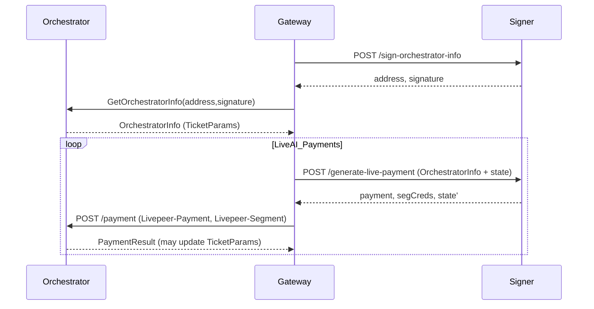

# Signer protocol (remote signer)

This document describes the **low-level protocol** between a go-livepeer **Gateway** and a go-livepeer **Remote Signer**.

It is intended for:

- Developers implementing gateways/SDKs (non-go-livepeer) that want to interact with the network via a signer
- Operators building or auditing a payment-clearinghouse signer service

## Overview

Remote signing splits “Ethereum responsibilities” out of the gateway:

- **GetOrchestratorInfo signing**: a cached signature + address used as a (weak/legacy) auth mechanism for orchestrator info requests.
- **Live AI payments (lv2v)**: the signer generates **probabilistic micropayment tickets** and returns them to the gateway for forwarding to the orchestrator.

The Live AI payment protocol is designed so the signer service can be **stateless** (no shared DB required) while still supporting stateful PM sessions. It does this by round-tripping an opaque signer state blob on every request.

## Terminology

- **O**: Orchestrator
- **G**: Gateway
- **S**: Remote Signer
- **OrchestratorInfo**: returned by GetOrchestratorInfo; includes TicketParams and pricing
- **TicketParams**: PM parameters returned by the orchestrator; expire and must be refreshed
- **Signer state**: an opaque blob (plus signature) returned by the signer and stored by the client

## Transport and encoding

All endpoints are HTTP `POST`.

JSON fields in requests/responses include `[]byte` fields; in JSON these are **base64-encoded** (Go’s `encoding/json` default for `[]byte`).

## Endpoints

### 1) `POST /sign-orchestrator-info`

Fetches the signer’s Ethereum address and a signature used by the gateway in `GetOrchestratorInfo`.

#### Request

- No request body is required.

#### Response (200)

JSON:

- `address`: `0x...` string
- `signature`: `0x...` string

#### Notes on encoding

The remote signer returns `address` and `signature` as **hex strings** with a `0x` prefix.

#### Notes / caveat

This signature is effectively **static**, **not scoped** to any one orchestrator, and **never expires**. It is a legacy aspect of the OrchestratorInfo flow and provides only weak authentication.

### 2) `POST /generate-live-payment`

Generates a signed Live AI payment (tickets) plus segment credentials, and returns updated signer state for the caller to retain.

#### Request: `RemotePaymentRequest`

JSON object:

- `state` (optional): opaque signer state previously returned by the signer
  - `state.state`: bytes (base64-encoded in JSON)
  - `state.sig`: bytes (base64-encoded in JSON)
- `orchestrator` (required): protobuf bytes of `net.PaymentResult` containing `OrchestratorInfo` (base64-encoded in JSON)
- `manifestID` (optional): ties into orchestrator accounting for a session (if omitted, signer will generate one)
- `inPixels` (required if `type` not set): number of pixels to generate a payment for
- `type` (optional): job type; currently `lv2v` for Live AI (`live-video-to-video`)

##### Live AI (`type: "lv2v"`) pixel calculation

If `type` is `lv2v`, the signer will compute pixels from elapsed time since the last update (it will “preload” 60 seconds of data on the first call).

If `type` is empty, you must provide `inPixels`.

#### Response: `RemotePaymentResponse` (200)

JSON object:

- `payment`: the value to send to the orchestrator in the `Livepeer-Payment` header
- `segCreds`: the value to send to the orchestrator in the `Livepeer-Segment` header
- `state`: updated signer state
  - `state.state`: bytes (base64-encoded in JSON)
  - `state.sig`: bytes (base64-encoded in JSON)

#### Refresh behavior (HTTP 480)

The signer returns HTTP status **480** (`HTTPStatusRefreshSession`) when the gateway should refresh its session:

- Fetch fresh orchestrator info (new `TicketParams`) via `GetOrchestratorInfo`
- Retry `/generate-live-payment` with the new orchestrator info

The go-livepeer gateway retries up to a small limit to avoid infinite refresh loops.

## Signer state model

The signer state is treated as an **opaque blob** by the gateway:

- Store it (per session / per orchestrator session) and send it back on the next `/generate-live-payment` call
- Do **not** modify it

The signer signs the serialized state with its Ethereum key and verifies the signature on subsequent requests to prevent tampering.

### Why state matters

Failure to consistently send valid, updated state can cause:

- invalid tickets (eg repeated nonces if TicketParams are reused incorrectly)
- excessive ticket generation / overpayment (lost balance accrual)

High-frequency or concurrent signing calls for the same session are likely to produce invalid tickets and are not an intended use-case.

## Gateway → orchestrator forwarding

After receiving a payment response, the gateway forwards it to the orchestrator:

- `POST {orch}/payment`
- Request headers:
  - `Livepeer-Payment`: value from `RemotePaymentResponse.payment`
  - `Livepeer-Segment`: value from `RemotePaymentResponse.segCreds`

The orchestrator’s payment response can include updated orchestrator info/ticket parameters; the gateway should retain and reuse those until they expire.

## Minimal sequence diagram

