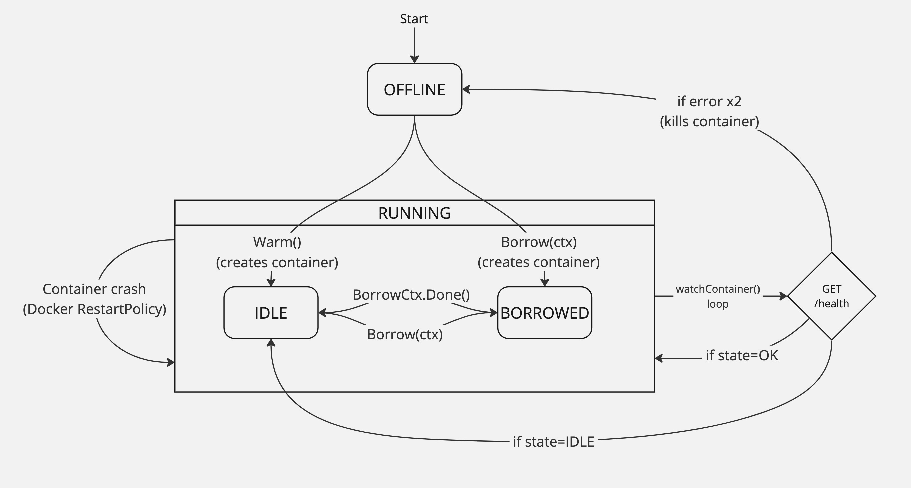

# AI Worker

The AI Worker node manages [`ai-runner`](https://github.com/livepeer/ai-runner) containers running on the host system.
These containers are started, monitored and stopped dynamically depending on the usage.

This diagram describes the lifecycle of a container:



Source: [Miro Board](https://miro.com/app/board/uXjVIZ0vO4k=/?share_link_id=987855784886)

It can also be described by the following mermaid chart, but the rendered version is more confusing:
```
stateDiagram-v2
    direction TB
    [*] --> OFFLINE
    OFFLINE --> IDLE: Warm()->createCont()
    OFFLINE --> BORROWED: Borrow(ctx)->createCont()
    state RUNNING {
        [*] --> IDLE
        IDLE --> BORROWED: Borrow(ctx)
        BORROWED --> IDLE: BorrowCtx.Done()
    }
    hc: GET /health
    RUNNING --> hc
    state healthcheck <<choice>>
    hc --> healthcheck
    healthcheck --> OFFLINE: if error x2
    healthcheck --> RUNNING: if state=OK
    healthcheck --> IDLE: if state=IDLE
```
