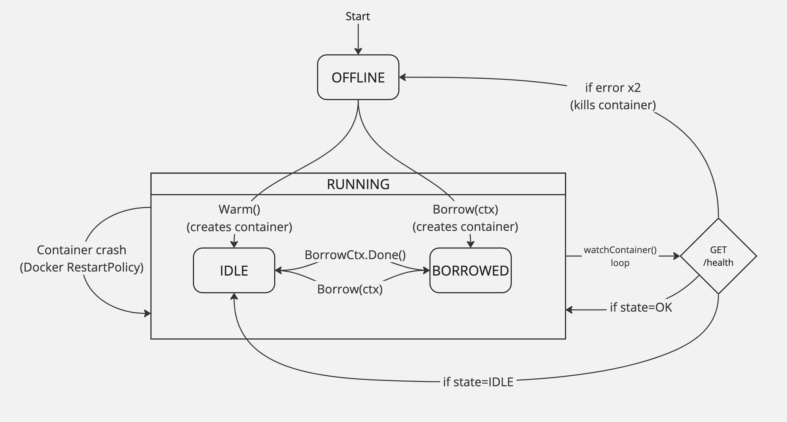

# AI Worker

An orchestrator started with `-aiWorker` manages live runner containers (for example the
`livepeer/ai-runner:live-app-*` and `daydreamlive/scope-runner` images) running on the host
system to serve `live-video-to-video`. These containers are started, monitored and stopped
dynamically depending on the usage.

The batch pipelines of the deprecated [`ai-runner`](https://github.com/livepeer/ai-runner)
(text-to-image, image-to-image, image-to-video, upscale, audio-to-text, segment-anything-2,
llm, image-to-text, text-to-speech) and the standalone AI worker node type were removed;
their routes answer `410 Gone`.

This diagram describes the lifecycle of a container:



Source: [Miro Board](https://miro.com/app/board/uXjVIZ0vO4k=/?share_link_id=987855784886)

It can also be described by the following mermaid chart, but the rendered version is more confusing:
```
stateDiagram-v2
    direction TB
    [*] --> OFFLINE
    OFFLINE --> IDLE: Warm()->createCont()
    OFFLINE --> BORROWED: Borrow(ctx)->createCont()
    state RUNNING {
        [*] --> IDLE
        IDLE --> BORROWED: Borrow(ctx)
        BORROWED --> IDLE: BorrowCtx.Done()
    }
    hc: GET /health
    RUNNING --> hc
    state healthcheck <<choice>>
    hc --> healthcheck
    healthcheck --> OFFLINE: if error x2
    healthcheck --> RUNNING: if state=OK
    healthcheck --> IDLE: if state=IDLE
```
